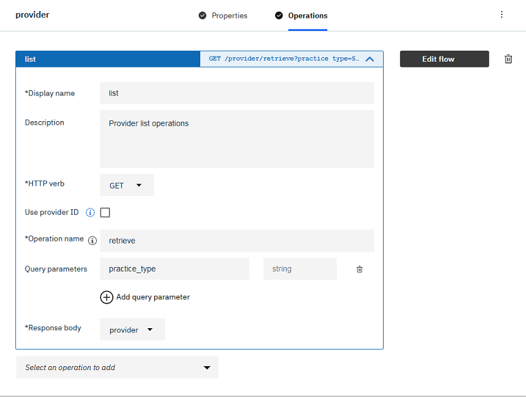
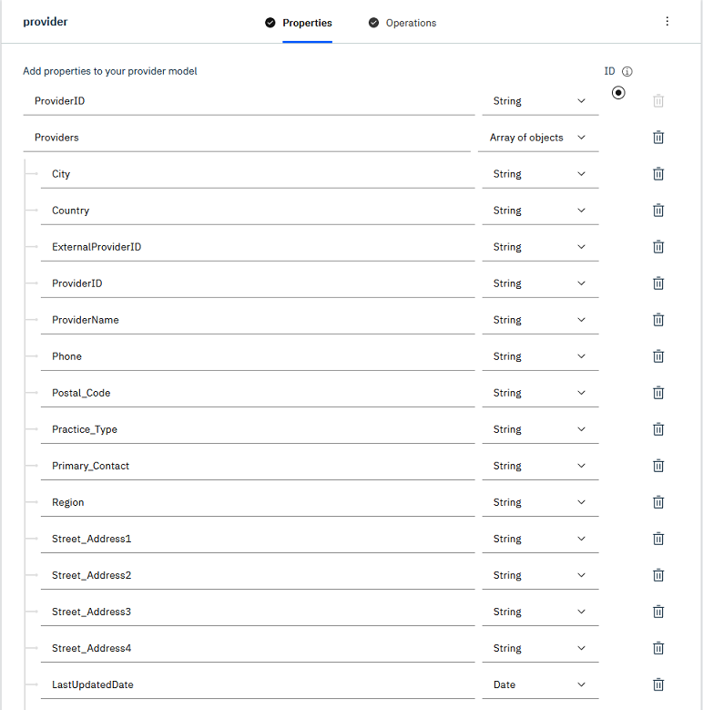
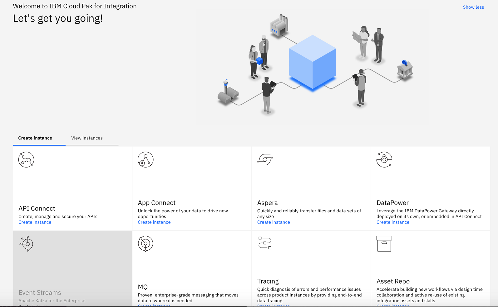
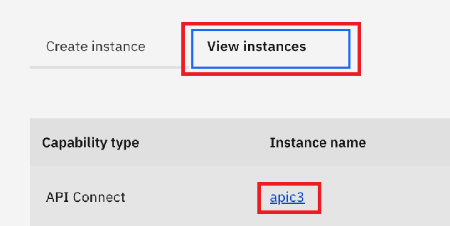
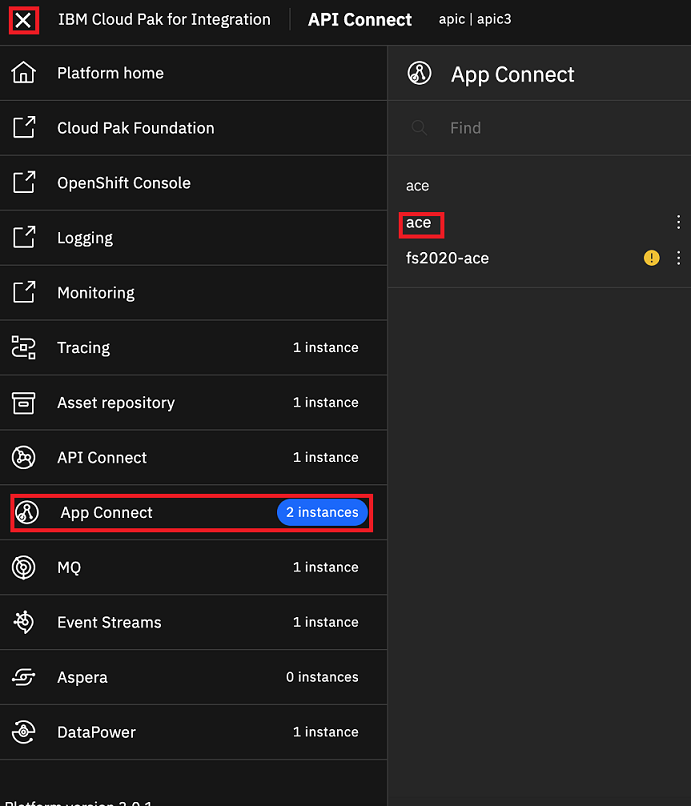

## Lab Overview
===============

One of the more prevelant implementation patterns out there that is driving Application and Integration Modernization is **API Led Integration**.  API Led Integration is built around the model exposing enteprise systems that are located on-premesis or within public/private/SaaS clouds using common standards like REST or GraphQL.  With this lab, you will be simulating the "day in the life" of a API developer at a Health Care Services company who has been tasked with importing integration assets and expose those assets as consumable APIs using the *Cloud Pack for Integration*.  You will be provided a pre configured CP4I cluster as well as some pre-configured integration artifacts and implement these as live integrations on the cluster and then expose those as consumable APIs.

## Cloud Pak for Integration

You will be using the *Cloud Pak for Integration* aka *CP4I* with this lab.  The Cloud Pak for Integration is one of six Cloud Paks IBM has created to help our customers on their journey to the cloud.  More information on the other cloud paks can be found [here](https://www.ibm.com/cloud/paks/).  The *Cloud Pak for Integration* is designed to provide the full spectrum of integration and digital transformation capabilities in a single platform that can be deployed wherever you like, in any cloud.  It is built on top of *Red Hat Open Shift* and provides the robust power and flexibility of Kubernetes that is purpose built for the enterprise.  More information on Open Shift can be found [here](https://www.openshift.com/).  The specific capabilities of the Cloud Pak for Integration are provided for you below:


### API lifecycle

Create, secure, manage, share and monetize APIs across clouds while you maintain continuous availability. Take control of your API ecosystem and drive digital business with a robust API strategy that can meet the changing needs of your users.

### Application and data integration

Integrate all of your business data and applications more quickly and easily across any cloud, from the simplest SaaS application to the most complex systems — without worrying about mismatched sources, formats or standards.

### Enterprise messaging

Simplify, accelerate and facilitate the reliable exchange of data with a flexible and security-rich messaging solution that’s trusted by some of the world’s most successful enterprises. Ensure you receive the information you need, when you need it — and receive it only once.

### Event streaming

Use Apache Kafka to deliver messages more easily and reliably and to react to events in real time. Provide more personalized customer experiences by responding to events before the moment passes.

### High-speed data transfer

Send large files and data sets virtually anywhere, reliably and at maximum speed. Accelerate collaboration and meet the demands of complex global teams, without compromising performance or security.

### Secure gateway

Create persistent, security-rich connections between your on-premises and cloud environments. Quickly set up and manage gateways, control access on a per-resource basis, configure TLS encryption and mutual authentication, and monitor all of your traffic.


## API Led Integration Basics

The basic premise of API Led Integration is based around the exposure of the valuable technical assets to innovate and reach into new areas of business, but do so in a fashion that is minimally disruptive to the enterprise, and is by its base nature secure and fast.  The primary capability within the Cloud Pak for Integration that handle this are *Application and data integration*, *enterprise messaging*, and *api lifecycle*


## Lab Environment

You will be provded an environment to implement the use case.  It is a pre-configured CP4I cluster that will be unique for each student.  It has instances of App Connect, API Connect and MQ that are setup for you to start implementing your use case right away.  This environment also contains some of the common services that are only part of the Cloud Pak for Integration like *Platform Tracing* and the *Platform Navigator*.  The use cases and the steps to implement each of these use cases will be provided below.

## The Use Case

ABC Health is in the process of modernizing their integration infrastructure, and has implemented a new installation of the Cloud Pak for Integration to support their new strateging initiatives around API enabling some older interfaces so they can be consumed by a wider audience.  To accomplish this, RESTful interfaces will be provided for each of the APIs using an API Gateway and managed using the API Management Capability provided by the Cloud Pak for Integration. There are a total of two APIs to implement, which will be described in the sections below.

### API 1 Provider Lookup

ABC uses a SaaS based CRM system (Salesforce) for maintaining their master data.  Since ABC Health is using the Cloud Pak for Integration, which includes the App Connect integration capability, the folks on the CRM integration team used the `App Connect Designer` to build a flow that exposed a custom object that was created for the Health Care Provider records.  You will not be creating this interface, as it has been created for you already, but you will be taking the deployable object (App Connect .bar file) and deploy it your CP4I Cluster.  The barfile used here is called `provider.bar` (note the case senstitivity.

The Provider Lookup API is a REST API that extracts out providers (aka Doctors) by type.  For the scope of this lab, there are two supported types "GP" for General Practioner or "Time Lords" for when they are needed.

API Supports the GET Method Supported with Query Parameters described here (taken directly from App Connect Designer):



The structure of the model used for the provider API is here:



### API 2 Invoice Processing

ABC is looking to automate the processing of invoices from their respective partners using a standard mechanism that is REST based, and plugs in neatly into their architecture.  This interface is exposed via a PUT Method that will receive in an invoice in JSON format coming in externally, whether it be from mobile, web or otherwise.  Once the invoice is received it will be put to queue (via MQ) for processing on the back end.  For this lab, the API covers the put to queue only.

This flow was created also by the Integration Team using the `App Connect Toolkit`.  Version 11 is used in the Cloud Pak for Integration and has been provided as a bar file.  You will deploy this bar file like Provider Lookup, but the parameters you use will be different.  The barfile used here is called `invoice-dte.bar` (note the case sensitivity).

### Using Skytap

For this lab, you might be using the Skytap interface to access your Cloud Pak for Integration environment.  Skytap provides the means to host and provide remote access to environments running on the IBM Cloud.  It provides a web browser based interface to access the various nodes on the instance.  While this is convenient, it also presents challenges in doing simple things like copy and paste. The simplest way to handle this would be to open this lab document up on the Developer machine *inside* of the Skytap interface.  There are ways to copy and paste from a host machine (e.g. the machine where you are accessing Skytap via the browser) and the remote Skytap machine.  Your instructor can demonstrate this as needed.

## Implementation of the APIs on the Cloud Pak for Integration

### Get acclimated with your demo environment

1. Your instructor will provide the information how to access your lab environments.
2. Once you have access to your environment, gog into your provided demo environment by selecting the "Developer" Machine from the list of machines
3. When the developer machine comes up, you can login into the OS with the credentials of `ibmuser` and the password of `passw0rd`.
4. It will drop you to the desktop of the developer machine.  All of the requisite applications you need are there.  This includes the Terminal and Web Browser and the Advanced REST Client.
5. Double Click on the `Terminal` application and it will take you to the command line.
6. Execute this command to do a clone of the git repository:
```
git clone https://github.com/ibm-cloudintegration/TechCon2020
```

7. execute this command to access the directory with the demo files `cd /TechCon2020/api-led-integration`.  You can list the directory if you like, but we are done with these files for now.  Leave the terminal window open.
8. Return to the Desktop on the Developer VM and then find the `Firefox` icon.  Double Click on it to bring up the browser.
9. There are a few bookmarks created for you on the browser.  The first one coming from the left is the OpenShift Console.  The location of that URL is `https://console-openshift-console.apps.demo.ibmdte.net/dashboards`. 
10. The next important bookmark is for the Platform Navigator.  You will be using this one the most. that url is `https://cp4i-integration.apps.demo.ibmdte.net/`.
11. **Important Note** you can only access these URLs from within the Skytap UI.  They are not accesible from the host machine used to access Skytap via its browser interface.  
12. Open up the Platform Navigator.  The credentials to access the navigator should already be pre-populated for you.  Click `Login`.
13. Once you are logged in, it will take you the *Platform Navigator*.  This portal provides you access all of your capabilities on the platform as well as the ability to create new instances of these capabilities.

14. To access an existing instance, click on the `View instances` tab within the platform navigator and then select the instance you want to access by clicking on the link.  For example, with API Connect, simply click the link

15. Once you click on the link, it will log directly into your provider organization on API Connect, re-using (or re-prompting for) your credentials provided for accessing the platform navigator.  The Cloud Pak for Integration uses the authentication provided by the Common Services layer for all of the primary portal components that make up the platform.
16. You can access the other capabilities of the platform from within another capability via the Platform Navigator Menu.  Let's try to connect to App Connect.  From the top left of the screen, select the "hamburger" menu icon, it looks like three consective horizontal lines.
17. The menu then pops up.  Select `App Connect` from the list.  Depending on your environment, you may see more than one instances running.  Select the `ace` instance to log into the Enterprise Manager.  It should log you right in, if your session is still active.  If not, it might prompt you log back in.  If so, the credentials are auto-filled for you.

18. This concludes the section on basic UI acclimation.  If you want to poke around some more, you can do so using the same menu we just used.  If you get lost, simply use the `Platform home` option from the menu, where it will take you back to the Platform Navigator. When you are ready to commence with the deployment of our APIs, move on to the next section.

### Deploy API #1

1. The first API to deploy is the `provider` API.  This integration has been created for you already and should have been pulled down from github already.
2. Before we can add and deploy the `provider.bar` we need to create a secret that will represent the credentials to our various cloud environments.
3. From your desktop on the Developer machine, return to your open terminal window or open a new `Terminal` session to access the CLI.
3. Change directories to `/home/ibmuser/TechCon2020/api-led-integration`.  This directory contains all the files for the lab (as well as local copy of the documentation).
3. The credentials to our cloud environments are on a file called `credentials.yaml.gpg`.  The file is encrypted.  
4. Decompress this file using this command `gpg -d credentials.yaml.gpg > credentials.yaml`.  When executing this command, it will prompt you for a password.  Ask your instructor for the password.
5. Log into the Open Shift cluster by using this command: `oc login -u admin -p passw0rd https://api.demo.ibmdte.net:6443`
6. Change context to the `ace` project by entering `oc project ace`
5. Next step is to create the secret. The script called `generateSecrets.sh` which is located in the `api-led-integration` will do that for us.
6. Make sure `generateSecrets.sh` is executble by using chmod (e.g.  `chmod 755 generateSecrets.sh`).
7. Create the secret by issuing this command: `./generateSecrets.sh designerSecret`
8. Once completed, it will advise you if the secret was created properly.  Confirm it created the secret by issuing a `oc get secrets`.
3. Next we will upload the `provider.bar` and set it up as its own release on App Connect.  Via the Platform Navigator, access the `ace` instance via the menu on the left or the main page.
4. Once you are on the main page of the ACE Enterprise Manager, click the `+Add Server` button.
5. Click the `+` in the box to open the search dialogue
6. Browse for the `provider.bar` on your file system.
7. continued....

### Deploy API #2

1. Change directories to `/home/ibmuser/TechCon2020/api-led-integration`.  This directory contains all the files for the lab (as well as local copy of the documentation).
2. Find the 