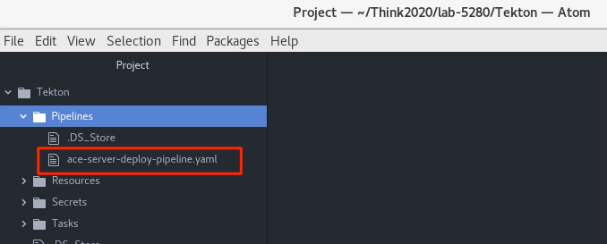

# Introduction

## Achieving Agile Integration Architecture

Modern applications are moving away from large-scale, monolithic architectures to more loosely coupled architectures based on microservices principles. This requires integrations to adopt microservices principles to enable agile updates, elastic scalability, ability to add or drop service functionality. The traditional centralized ESBs have a rigid infrastructure and does not provide the flexibility required for new architectures. Modern loosely coupled applications architectures require agile integration. 

IBM App Connect Enterprise V11 delivers a platform that supports [agile integration](https://www.ibm.com/cloud/integration/agile-integration) required for a modern digital enterprise. 

### Lab Objectives

In this hands-on lab you will learn develop to deploy of agile integration with IBM App Connect Enterprise (ACE) in Cloud Pak for Integration (CP4I). CP4I runs on OpenShift Container Platform and enables container deployment of integrations for microservices applications.  

In [Part 1](#Part 1: Test the the integration application locally using ACE docker image), you will start with simple integration application and test the application locally using ACE docker image to ensure it is ready for deployment to OpenShift Container Platform. 

In [Part 2](#Part 2: Deploy the integration application to OpenShift Container Platform using OpenShift pipelines), you will use DevOps principles to deploy the integration application to OpenShift Container Platform using OpenShift pipelines and Tekton dashboard which allows you to run CI/CD pipeline in a Kubernetes-native approach to perform fully automated deployment. You will configure OpenShift pipeline, Tekton dashboard and configure the pipeline artifacts required to automate deployment of the integration application to OpenShift within Cloud Pak for Integration. 

[Cloud for Integration](https://www.ibm.com/cloud/cloud-pak-for-integration) runs on Red Hat OpenShift container platform and is an integration platform for cloud native modern applications. 

### Environment used for this lab

1. Cloud Pak for Integration runnnig on OpenShift Container Platform V4.2 running with one master, and four worker nodes. 
2. Developer VM you will use to access the OpenShift cluster for the lab. 

	**Informaton required to perform the lab:** 
		
	Login credentials for the Developer VM
		
	User ID: **ibmuser**
		
	Password: **passw0rd**
		
	Note, the password contains a zero, not an uppercase letter O.
	
	After logging into the Developer VM, you can use following URLs to access :
	
	OpenShift Admin Console : [https://console-openshift-console.apps.demo.ibmdte.net/dashboards](https://console-openshift-console.apps.demo.ibmdte.net/dashboards)
		
	CP4I Platform Navigator : [https://cp4i-integration.apps.demo.ibmdte.net/](https://cp4i-integration.apps.demo.ibmdte.net/)

3. The artifacts to perform this lab are available on a public Git repo. Open a terminal window and clone the git repo using below command.

`git clone https://github.com/ibm-cloudintegration/Think2020.git`

The artifacts for the lab can be found in the following directories. 

* `/home/ibmuser/Think2020/lab-5280`

-
Note: You will need an account on `github.com` to perform this lab. You can use your existing account if you have one. If not, you can create a account on [github.com](github.com) before proceeding.
-

### Part 1: Test the the integration application locally using ACE docker image

In this section of the lab, you will start with simple integration application and test the application locally using ACE docker image to ensure it is ready for deployment to OpenShift Container Platform. You will: 

1. Pull ACE docker image from Docker Hub following instructions on Docker Hub https://hub.docker.com/r/ibmcom/ace/
2. Run Integration Server within a docker container for local testing.
3. Perform local testing of the provided compiled integration application by deploying the BAR file to a local Docker ACE Container. 

#####1. Pull ACE docker image from Docker Hub 

Pull the docker image for ACE from Docker Hub repository using command:

`docker pull ibmcom/ace`

The docker image is already loaded in the lab environment to save time from downloading the image.  

See the docker images available in local repository using command:

 `docker images`

#####2. Run Integration Server within docker container for local testing

Run the ACE image in a docker container using below command for local testing of the integration application 

`docker run --name acetestserver -p 7600:7600 -p 7800:7800 -p 7843:7843 --env LICENSE=accept --env ACE_SERVER_NAME=TESTSERVER ibmcom/ace:latest`

Command will start ACE integration server running in local docker container. You should see the following messages:

Leave the terminal window open with the integration server running in docker container. If you interrupt the command it will stop the Integration server and terminate the container.

#####3. Perform local testing of the provided compiled integration application (bar file)

Open another terminal window and change directory to `/home/ibmuser/Think2020/cp4i-ace-server-master/cp4iivt/gen`

Deploy the bar file `cp4ivt.bat` in this directory using the following command. The bar file consists of a simple REST API integration flow. 

mqsideploy --admin-host localhost --admin-port 7600 --bar-file cp4iivt.bar

The output messages from the command shows the bar file has been successfully deployed to the integration server you have previously started as docker container. 

Test the simple integration flow by starting Firefox browser and enter the below url to call the API. 

`http://localhost:7800/cp4iivt/v1/hello`

You should see the result as shown below:

As an optional, you can review the integration flow in the project directory using ACE toolkit.

 `/home/ibmuser/Think2020/cp4i-ace-server-master/cp4iivt/`
 
This completes Part 1 of the lab.  This shows that the integration application in bar file cp4ivt.bar is tested locally and ready for deployment to Cloud Pak for Integration using DevOps OpenShift pipelines. 

-

###Part 2: Deploy the integration application to Cloud Pak for Integration OpenShift Container Platform using OpenShift pipelines 

In this part of the lab, you will learn:

1. Basic concepts used by OpenShift pipelines
2. Define a pipeline to automate build and deploy ace integration application
3. Run the pipeline using Tekton dashboard and check status 
4. Test the integration application deployed by the pipeline

This shows you how to acheive aigle integration. 

#####1. Basic concepts of OpenShift pipelines

OpenShift Pipelines is a cloud native Kubernetes-style CI/CD solution designed to run each step of the CI/CD pipeline in its own container, allowing each step to scale independently to meet the demands of the pipeline. OpenShift Pipelines is based on Tekton open source project. 

Follow this [link for a short introduction to OpenShift Pipelines](https://www.openshift.com/blog/cloud-native-ci-cd-with-openshift-pipelines)

OpenShift CI/CD pipline is defined usig a set of Kubernetes custom resource definitions (CRD). The following is a brief introduction to these CRDs:

*     **Pipeline:** A collection of tasks that are executed in a defined order.
*     **Task:** A sequence of commands (steps) that are run in the pipeliine. Tasks are run in separate containers in the pipeline pod.
*     **PipelineResource:** Inputs (e.g. git repo) and outputs (e.g. image registry) to a pipeline.
*     **Secrets:** Secrets that are required to access the input and output resources for pipeline.
*     **PipelineRun:** Runtime representation of an execution of a pipeline.
*    **TaskRun:** Runtime representation of an execution of a task.

Following diagram shows all the artifacts and the references between them:

#####2. Define a pipeline to automate build and deploy ace integration application

The definitions required to automate build and deploy an ace integration for this lab have been provided for you. You can find them in directory `/home/ibmuser/Think2020/lab-5280/Tekton`. 

Open a terminal window and change directory to `/home/ibmuser/Think2020/lab-5280/Tekton`. List the contents of the directory and you should see the following. 

You will see four directories  as shown above, where the name of each directory indicates the definitions it contains. Change into each directory and review the definitions provided for you. They will be as follows:

1\. `Pipelines` : This directory contains the pipeline definition `ace-server-deploy-pipeline.yaml`. As the name indicates, this definition is for the automated ace server deployment pipeline.  

The definition `ace-server-deploy-pipeline.yaml` builds an ace image with the compiled integration application bar file and deployes the image to Cloud Pak for Integration OpenShift platform. 

In terminal, type`atom` to open the editor to review these definitions.

Open the folder Tekton to view the definitions. 

Expand `Pipelines` and select defintion to review the definition provided for you. 

You can see the pipeline definition is calling tasks `build-image` and `install-ace-server`. The definitions for these tasks are in the `Tasks` directory. 

2\. `Tasks` : In atom editor, expand this directory and you will see the two tasks definitions `build-ace-server-task.yaml` and `install-ace-server-task.yaml`. The names of these task definitions indicate the functions being performed respectively. 

The first task definition `build-ace-server-task.yaml` builds an ace image with the compiled integration application bar file and pushes the image into OpenShift image registry. 

Select this task to review the definition and you can see an input property `dockerfileLocation` from where it fetches Dockerfile to build the ace image. The tasks uses `Git` as input resource and `OpenShift image repository` as output resource. The `Dockerfile` used by the task can be found in directory `/home/ibmuser/Think2020/cp4i-ace-server`. The build is performed by a cloud native tool called `buildah` which facilitates building container images. During execution of the pipeline, buildah is pulled from quay.io repository if it is not available locally. 

Select the second task `ace-server-deploy-pipeline.yaml` to review the definition. This task deployes the ace image that was built by the build task to Cloud Pak for Integration OpenShift platform. This task requires CLI tools `oc, cloudctl and helm` to perform the deployment. When pipeline is executed, during the task run the docker image specifically built with these tools is pulled from `docker.io/pimandi/cloudctl-helm-oc`.

3\. `Resources` : The resource definitions used by the tasks are provided for you in this directory. In atom editor, expand this directory and you will see the two resource definitions `cp4i-ace-server-source-pipelineresource.yaml` and `cp4i-ace-server-image-pipelineresource.yaml`. 

Click on each of these definitions and you can see the resources used by the tasks for the execution of the pipeline.  The resource uses a Git repo `https://github.com/ibm-cloudintegration/Think2020` for source and OpenShift image registry for the image. 

4\. `Secrets` : Running the pipe requires access credentials to the input and output resources being used by the tasks. The definitions for secrets are provided for you. 

In atom editor, expand this directory and you will see the definitions for secrets as shown below.  

Next, we will updated the definitions for Secrets for your environment. 

Click on the definition `cp4i-git-secret.yaml` and update with your Git username and password as indicated in the below parameters and save the definition. 

The next definition that needs to be updated is `cp4i-docker-secret-yaml`. This definition is for the docker credentials for the pipeline to push the image to OpenShift registry. 

Click on the definition `cp4i-docker-secret.yaml` and update the parameter shown below with OpenShift login token for your environment. Note, in the lab environment the username is set to `admin`. 

To get the OpenShift login token, open Firefox browser and click on the bookmark `Console - OpenShift` as shown below. 

This will take you to the log in page with a couple of login options. Select `htpasswd` option to login to OpenShift as shown below. 

Click on `Login` usinig the pre-filled userid and password as shown below. 

Next, to get the login token required for the Secret, click on drop down arrow next to userid `admin` at the top right corner as shown below and select `Copy Login Command`. 

This will open up a new brower page with a link to `Display Token` as shown below. 

Click on the `Display Token` link to get the login token and the command to use to login from a terminal. 

Copy the command and paste it in a terminal to get logged into OpenShift as shown below so you can run commands from the terminal later. 

Also copy the token and update the definition for secret `cp4i-docker-secret.yaml`

Now that you have all the definitions required to run the pipeline for your environment, we are ready to run the pipeline. 

#####3. Run the pipeline using Tekton dashboard and check status 

In this lab we will use OpenShift pipelines as the CI/CD tool and Tekton dashboard to run the pipeline and see the status. These tools have already been installed for you in the lab environment. 

Openshift pipeline requires a project for running a pipeline. From the terminal in which you logged into OpenShift earlier, run the following command to create the project `cp4i-setup`.

`oc new-project cp4i-setup`

This command will create the project and will start using the project as shown below. 

Next we will create all the definitions required for the pipeline within this project. We will use the below shown command to create OpenShift resources using all the definitions files you have previously reviewed. 

`oc create -f <definition.yaml>`

In terminal window, change directory to `/home/ibmuser/Think2020/lab-5280/Tekton/Secrets`. You should see the definitions for secrets you have previously updated in this directory as shown below. 

Using the command provided above, create the three secrets as shown below. 

Next change directory to `/home/ibmuser/Think2020/lab-5280/Tekton/Resources`. You should see the definitions for pipeline resources you have previously reviewed as shown below. 

Using the command, create the two pipeline resources as shown below.

